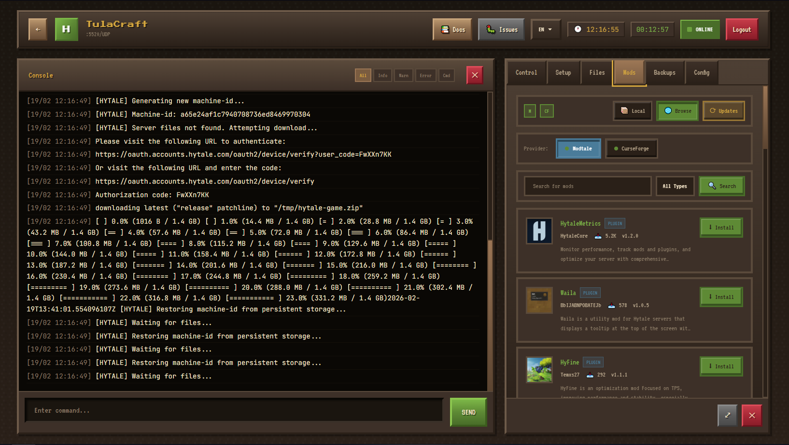

# HytalePanel

Docker-based web panel for managing multiple Hytale dedicated servers.



<p align="center">
  <sub>If this project is useful to you and you'd like to support its development (or others like MinePanel), any help is appreciated:</sub>
  <br><br>
  <a href="https://buymeacoffee.com/pims2711y" target="_blank">
    
  </a>
</p>

## Features

- 🖥️ **Multi-Server Management** - Create and manage multiple servers from one panel
- 📜 **Real-time Console** - Live logs with WebSocket
- 📁 **File Manager** - Upload, edit, delete server files
- 🔧 **Mod Manager** - Install mods from [Modtale](https://modtale.net) or [CurseForge](https://curseforge.com/hytale)
- 🔄 **Auto-Updates** - Track and update server files with one click
- 🔐 **Authentication** - JWT auth with SSO support
- 🌍 **Multi-language** - English, Spanish, Ukrainian

## Documentation

For detailed guides, configuration options, and API reference:

📚 **[hytalepanel.ketbome.com](https://hytalepanel.ketbome.com)**

- [Getting Started](https://hytalepanel.ketbome.com/guide/getting-started) - Installation and setup
- [Configuration](https://hytalepanel.ketbome.com/guide/configuration) - All environment variables
- [Mods](https://hytalepanel.ketbome.com/guide/mods) - Modtale & CurseForge integration
- [Panel Guide](https://hytalepanel.ketbome.com/guide/panel) - Using the web interface
- [Development](https://hytalepanel.ketbome.com/guide/development) - Contributing and local dev
- [ARM64](https://hytalepanel.ketbome.com/guide/arm64) - Apple Silicon / Raspberry Pi
- [Troubleshooting](https://hytalepanel.ketbome.com/guide/troubleshooting) - Common issues

## Quick Start

```bash
# 1. Create folder and download files
mkdir hytale && cd hytale
curl -O https://raw.githubusercontent.com/ketbome/hytalepanel/main/docker-compose.yml
curl -O https://raw.githubusercontent.com/ketbome/hytalepanel/main/.env.example

# 2. Configure
cp .env.example .env
nano .env  # Change PANEL_USER and PANEL_PASS!

# 3. Start
docker compose up -d

# 4. Open http://localhost:3000
```

**Default login:** `admin` / `admin` — **Change this!**

## Configuration

Basic `.env` settings:

```env
PANEL_USER=admin
PANEL_PASS=your_secure_password
JAVA_XMS=4G
JAVA_XMX=8G
```

### Mod Integration (Optional)

```env
# Modtale - Get key from https://modtale.net
MODTALE_API_KEY=your-key

# CurseForge - Get key from https://console.curseforge.com
# Note: Wrap in single quotes (keys contain $ characters)
CURSEFORGE_API_KEY='$2a$10$your-key-here'
```

## Ports

| Service | Port     |
| ------- | -------- |
| Game    | 5520/UDP |
| Panel   | 3000/TCP |

## Contributing

See [CONTRIBUTING.md](CONTRIBUTING.md)

## Contributors

<a href="https://github.com/Ketbome/hytalepanel/graphs/contributors">
  
</a>

## License

**Free for personal and non-commercial use.**

Commercial use by companies with >$100k revenue requires permission. See [LICENSE](LICENSE).

---

<p align="center">
  <sub>If you'd like to support this project, any help is appreciated 💙</sub>
  <br><br>
  <a href="https://buymeacoffee.com/pims2711y" target="_blank">
    
  </a>
</p>

<p align="center">
  <em>This project is not affiliated with Hypixel Studios or Hytale.</em>
</p>
